# CrowPanel App Suite
## A large-format touch platform for real embedded interfaces

The [Elecrow CrowPanel Advanced 7-inch ESP32-P4 HMI AI Display](https://www.awin1.com/cread.php?awinmid=82721&awinaffid=2977153&ued=https%3A%2F%2Fm.elecrow.com%2Fpages%2Fshop%2Fproduct%2Fdetails%3Fid%3D208494) is a remarkably capable piece of hardware. This repository treats it like a product platform rather than a tiny demo screen.

It is a collection of 22 standalone touch applications for field work, creative work, games, dashboards, and hardware experiments. The common thread is simple: give the device interfaces that feel made for a 7-inch screen.

The result is a portable embedded desktop that can become a camera, groovebox, aircraft radar, writing desk, game system, HID keyboard, network tool, ebook reader, or instrument panel without changing the display hardware.

The repository is Arduino CLI only. Detailed toolchain setup, hardware notes, feature flags, wiring, companion boards, safety boundaries, and proof requirements live in [TECHNICAL.md](TECHNICAL.md).

## In the field

The photos below show the suite running on the CrowPanel, including SurveyOps, Pokedex, Cypher Boy, CypherDrive, ADS-B Radar, LiteGo, Vision Cam, and Cypher Desk. They are illustrative device captures, not a replacement for the per-project proof record.

  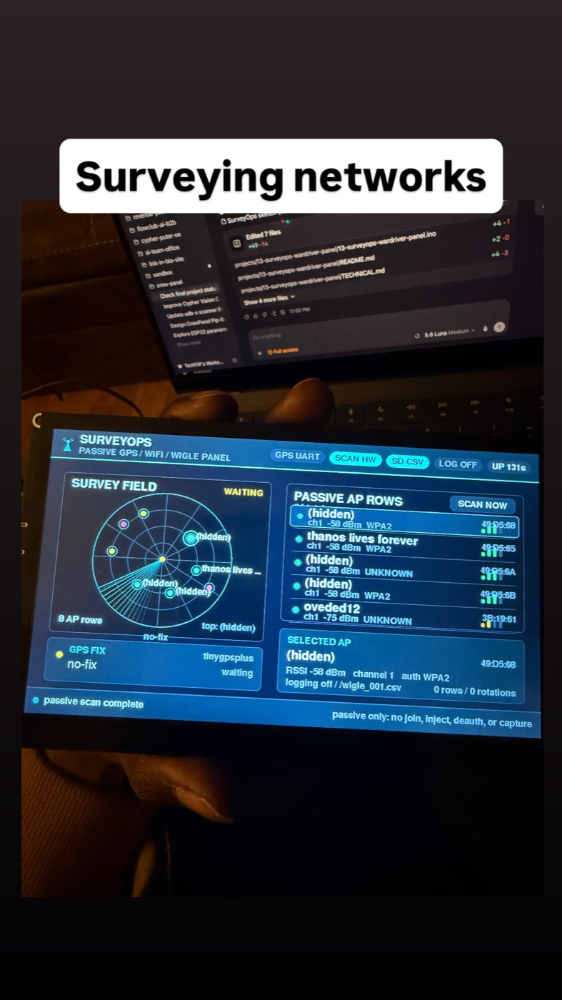
  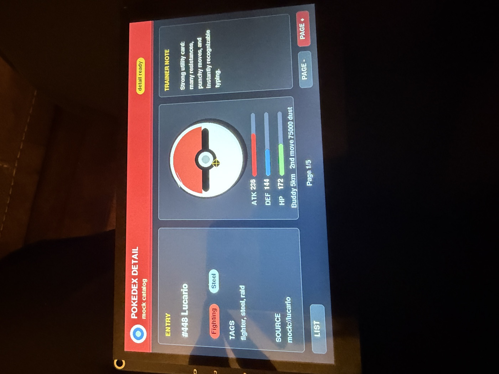
  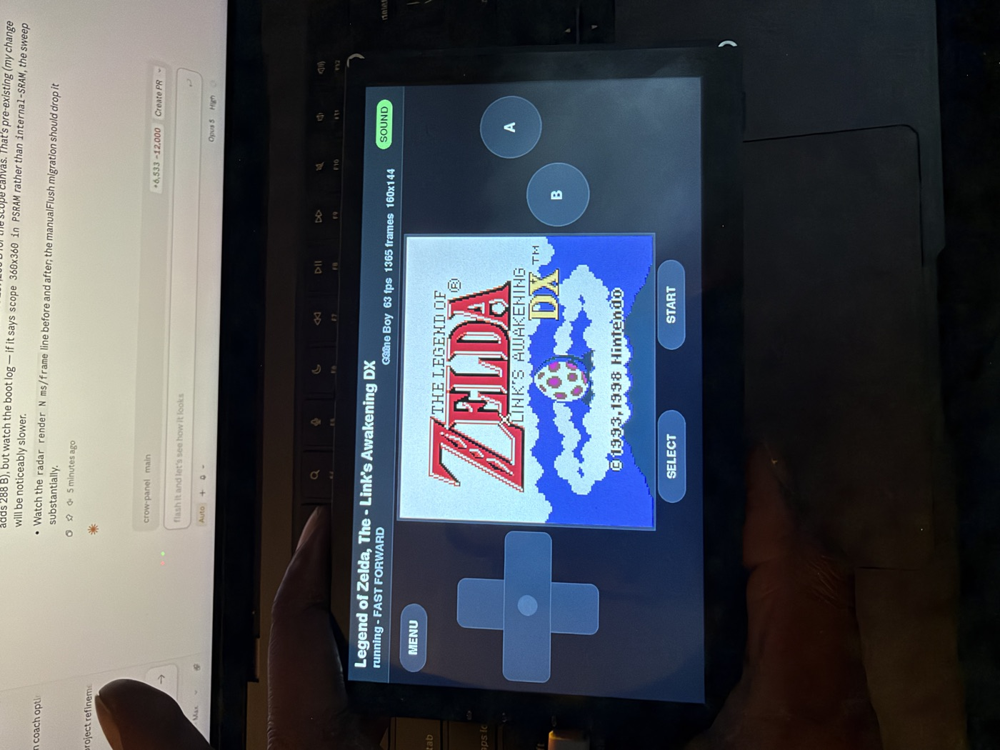

  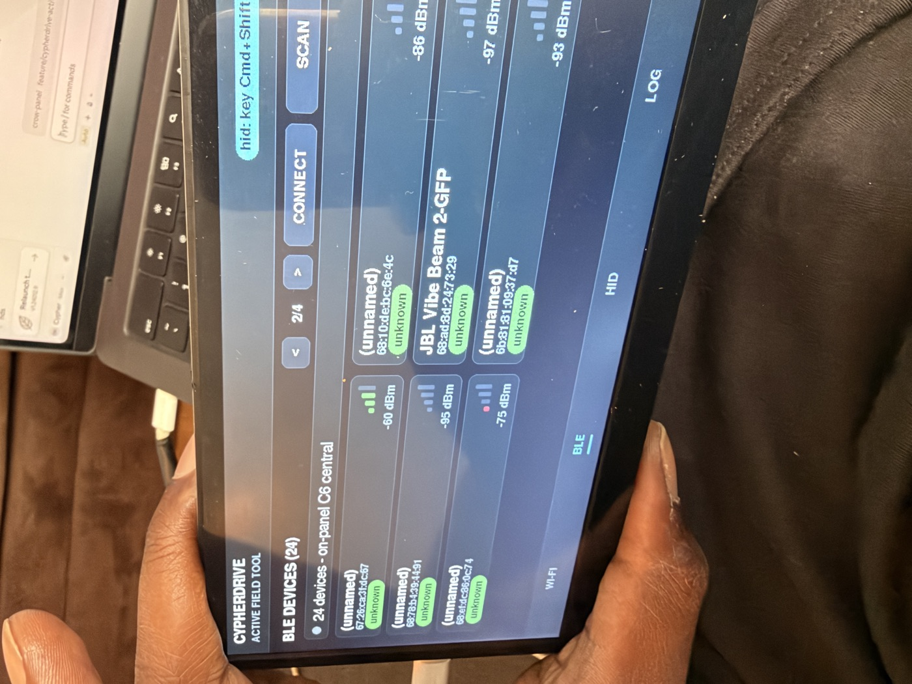
  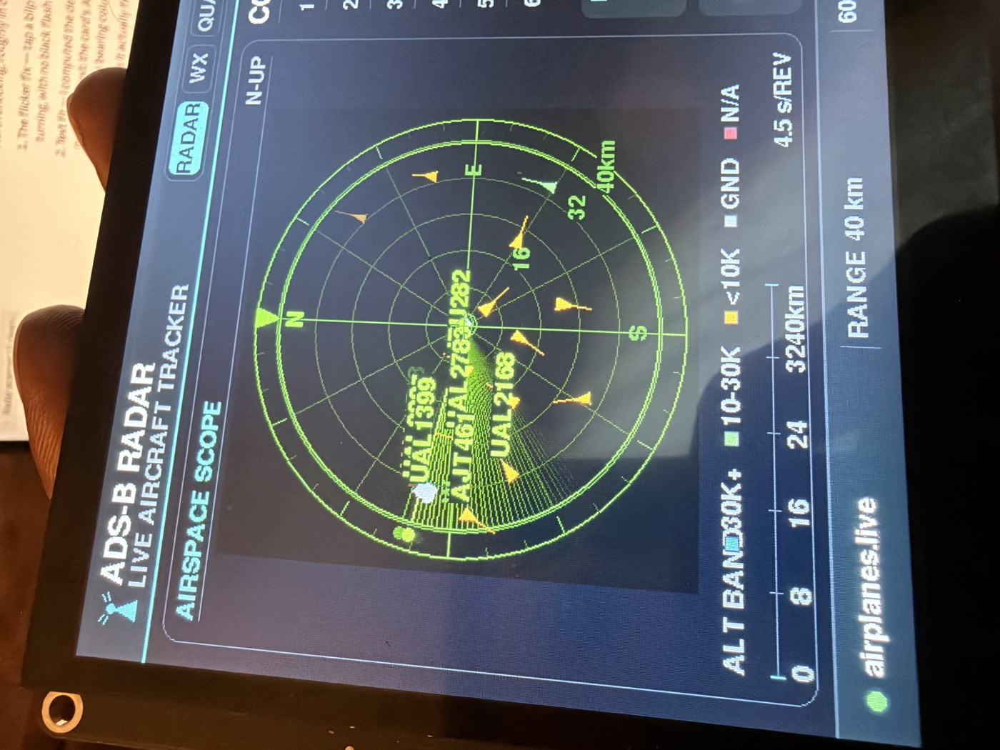
  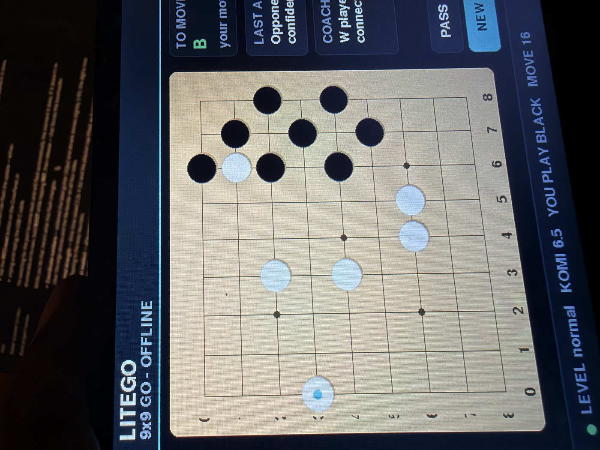

  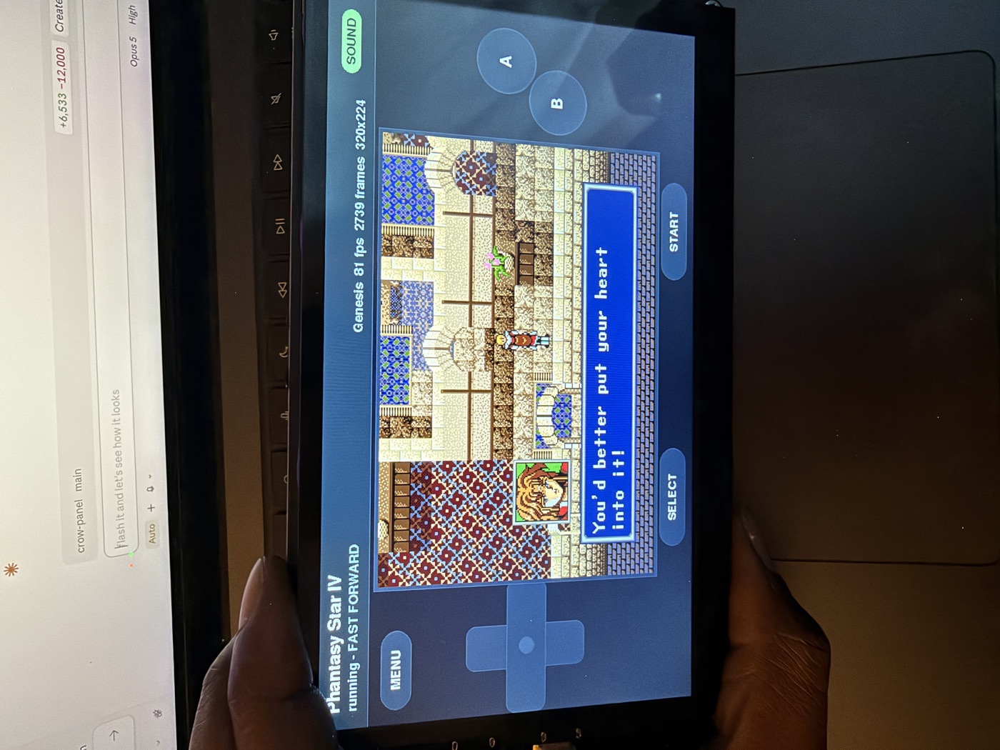
  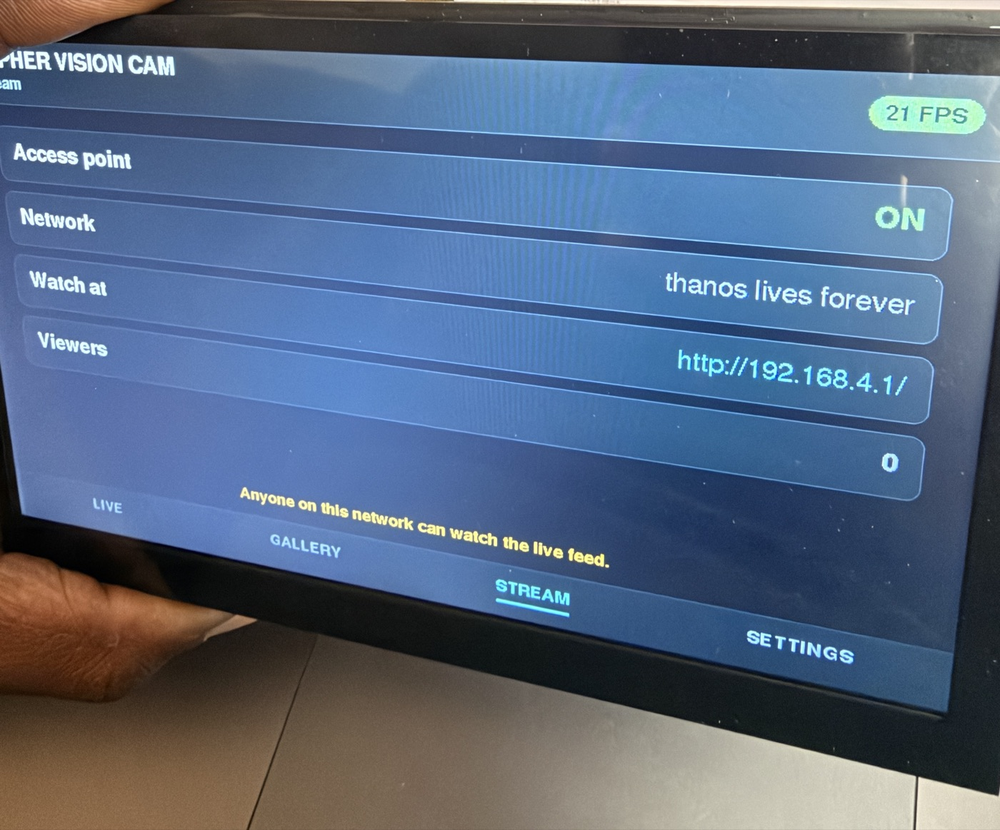
  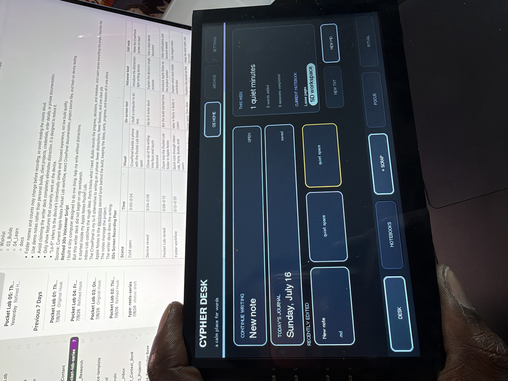

  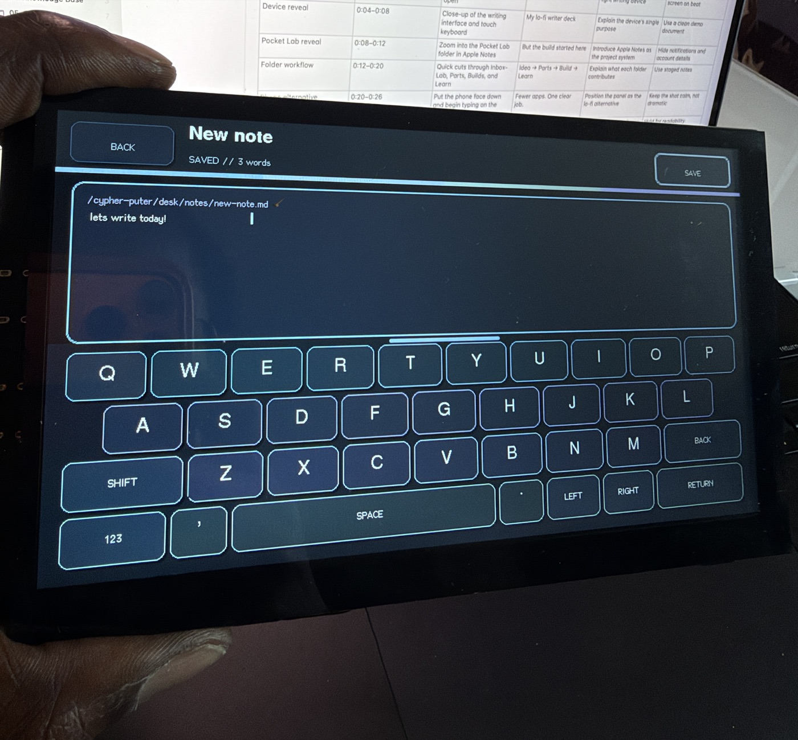
  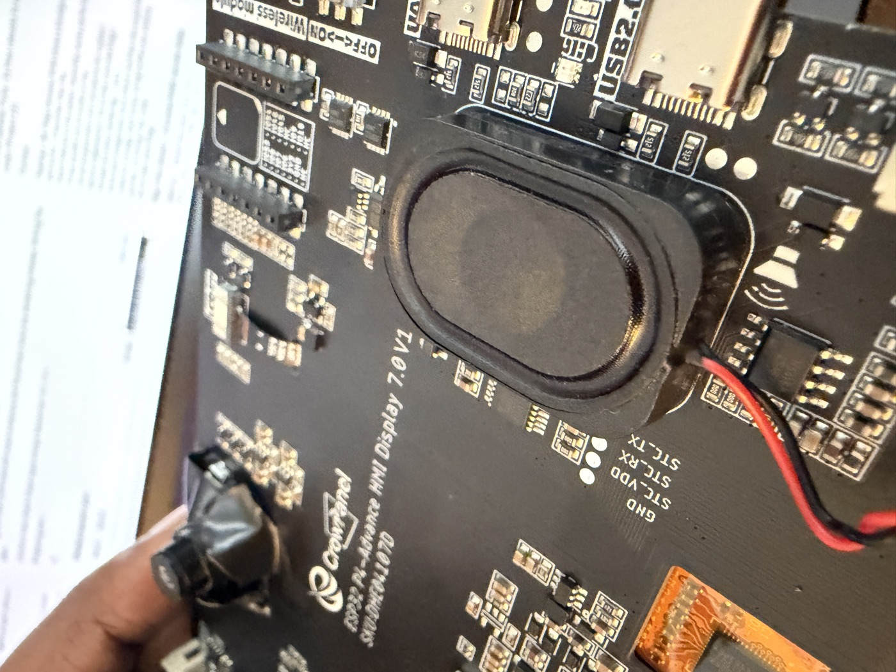
  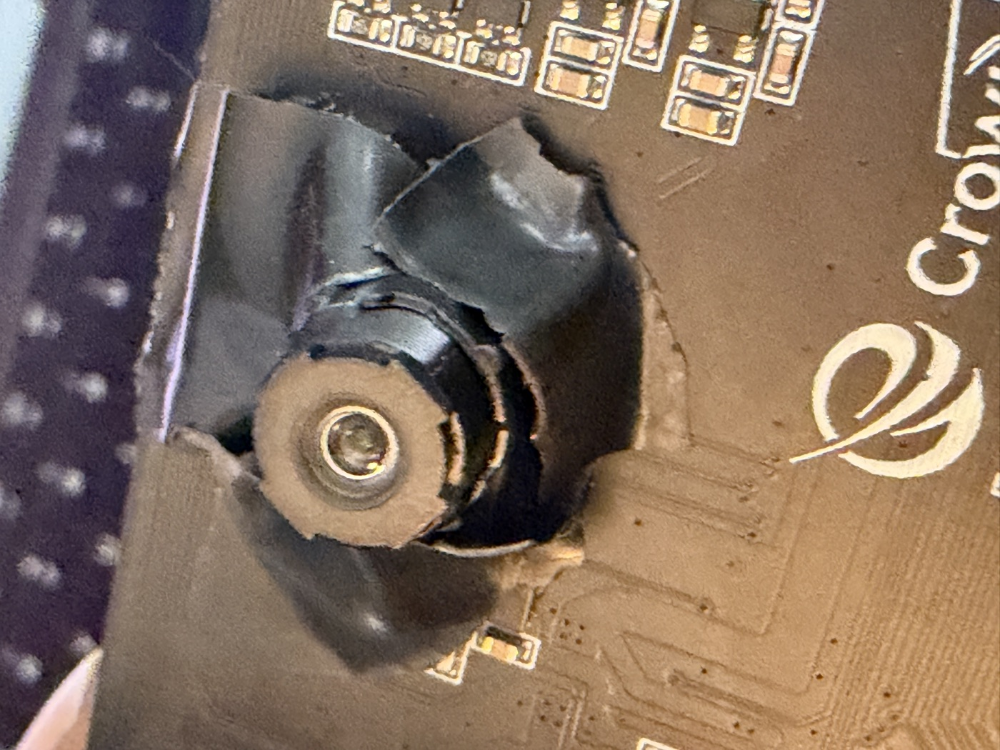

## What this shows off

- **A real embedded UI surface:** dashboards, touch controls, games, writing tools, maps, radars, catalogs, and media views designed around 1024×600
- **One device, many products:** the same CrowPanel becomes a camera, music machine, field computer, game console, radar, or desk companion through a different sketch
- **The hardware working as a system:** display, capacitive touch, SD storage, audio, camera, USB, BLE, Wi-Fi, and optional sensors are routed into complete applications
- **A practical Arduino workflow:** each app is standalone, mock-first, and documented, making the suite useful as both a showcase and a starting point for new CrowPanel builds

## Features

- 1024×600 capacitive touch interface with bespoke interfaces for every app, landscape or portrait
- ESP32-P4 rendering with shared display, touch, storage, audio, camera, and serial foundations
- Onboard ESP32-C6 connectivity for Wi-Fi and BLE applications
- SD-backed files, photos, audio, ROMs, books, logs, catalogs, and workspaces
- Camera, microphone, speaker, USB HID, Bluetooth HID, GPS, NFC, LoRa, and radio-module integrations across the suite
- Mock-first operation so many projects can be explored before optional hardware is connected
- Host-side tests for selected game, HID, protocol, catalog, and document-parsing logic
- Honest proof labels: compile-ready, uploaded, and field-proven are kept separate

## Apps

| App | Description | Location |
|---|---|---|
| FieldOps Control Center | Remote sensor operations dashboard with LoRa and ESP-NOW-over-UART paths | [in-progress/01](in-progress/01-fieldops-control-center) |
| Cypher Vision Cam | Touch camera, SD gallery, MJPEG clips, and local web stream | [02](projects/02-cypher-vision-cam) |
| BadgeOps NFC/RFID | Read-only badge and tag inspection workflow | [in-progress/03](in-progress/03-badgeops-nfc-rfid-system) |
| RelayOps Wi-Fi Control Hub | Sensor events, GPIO controls, and environmental dashboards | [04](projects/04-relayops-wifi-control-hub) |
| CypherDrive | Active field tool for configured Wi-Fi, BLE, and operator-driven HID work | [05](projects/05-cypherdrive-wireless-ops) |
| NFC Field Lab / BadgeOps Pro | UID, NDEF, APDU, tag files, and grant/deny registry | [07](projects/07-nfc-field-lab-badgeops-pro) |
| Cypher Gamer Arcade | Touch Pong, Snake, and 2048 arcade | [08](projects/08-cypher-gamer-arcade) |
| Cypher Tune MPC | Multitouch groovebox, sampler, sequencer, and synth kit | [09](projects/09-cypher-tune-mpc) |
| LiteGo Touch Coach | Offline 9×9 Go with hints, undo, scoring, and Monte Carlo play | [10](projects/10-litego-touch-coach) |
| CardRF Spectrum Console | Receive-only spectrum and heatmap console | [in-progress/11](in-progress/11-cardrf-spectrum-console) |
| SurveyOps Wardriver Panel | Passive GPS and Wi-Fi site survey with CSV logging | [13](projects/13-surveyops-wardriver-panel) |
| ADS-B Flight Tracker Radar | Live aircraft radar with weather and other data screens | [14](projects/14-adsb-flight-tracker-radar) |
| Pokedex Panel | Offline creature catalog and field guide | [15](projects/15-pokedex-panel) |
| Cypher Flock Panel | Passive multi-board Wi-Fi and BLE detection surface | [in-progress/16](in-progress/16-cypher-flock-panel) |
| LittleHakr RF Lab | Receive and register-proof bench for supported radio modules | [17](projects/17-littlehakr-rf-lab) |
| Cypher Desk OS | Offline-first writing, media and creator workstation | [18](projects/18-cypher-desk-panel) |
| Starbeam Console | Arm-gated lab console for the author's transmit-capable radio build | [in-progress/19](in-progress/19-starbeam-console) |
| Pip-Boy 3000 Terminal | Fan-prop launcher with stats, map, gallery, and audio | [20](projects/20-pipboy-terminal) |
| Cypher Keys HID Deck | Touch keyboard, macros, launcher, and USB/Bluetooth HID | [21](projects/21-cypher-keys-hid-deck) |
| Cypher Boy | SD-backed Game Boy, GBC, NES, and Mega Drive player | [22](projects/22-cypher-boy) |
| Acid Glass | Touch-playable generative visual instrument with twelve procedural scenes | [in-progress/24](in-progress/24-acid-glass-visualizer) |
| Inkwell Reader | Portrait e-ink-style ebook reader for TXT, Markdown, and EPUB | [in-progress/25](in-progress/25-inkwell) |

## Start here

- [Technical reference](TECHNICAL.md) for installation, compiling, uploading, hardware, flags, safety, and proof vocabulary
- [Full proof matrix](docs/full-port-proof-matrix.md) for the current evidence state of every project
- [Hardware bring-up checklist](docs/hardware-bringup-checklist.md) for staged board testing
- [Hardware risk register](docs/hardware-risk-register.md) for known bench failures and mitigations
- [Troubleshooting](docs/troubleshooting.md) for build and flash problems
- Each app has a concise `README.md` and a detailed project-level `TECHNICAL.md`

## License

The suite is MIT licensed. See [LICENSE](LICENSE). Project 22 vendors separately licensed emulator cores and documents those terms in its project folder. No ROMs, game assets, or third-party sample packs are distributed here.

Pip-Boy, Pokémon, and other referenced marks belong to their respective owners. Those projects are unofficial and unaffiliated.
